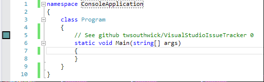

# Visual Studio Issue Tracker

Download this extension from the VS Gallery (Comming Soon)
or get the [CI build](http://vsixgallery.com/extension/IssueTrackerTaylor%20Southwick.2598c768-4628-4044-b4bf-e262116a3e3b/).

---------------------------------------

Adds markers to the margin to indicate the status of issues embedded within comments. Currently supports issues from:

- GitHub

See the [change log](CHANGELOG.md) for changes and road map.

## Features

- Shows a margin marker for any issues it finds for GitHub

[]

## Contribute
Check out the [contribution guidelines](CONTRIBUTING.md)
if you want to contribute to this project.

## License
[Apache 2.0](LICENSE)